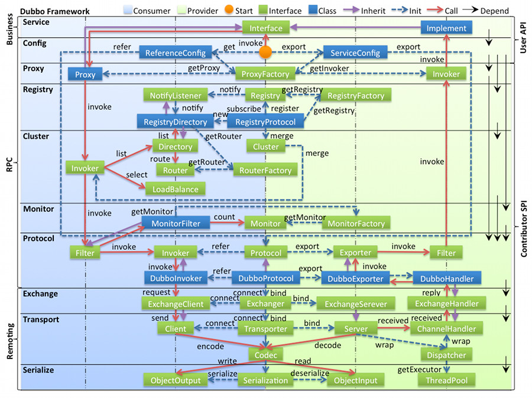

= 笔记

== dubbo-common
- link:dubbo-common/Dubbo中的SPI机制.adoc[Dubbo中的SPI机制]
- link:dubbo-provider/编解码过程.adoc[编解码过程]

== dubbo-registry
- link:dubbo-registry/注册中心实现.adoc[注册中心实现]

== 其他
- link:dubbo-provider/服务端启动过程.adoc[服务端启动过程]
- link:dubbo-provider/服务端如何处理调用请求.adoc[服务端如何处理调用请求]
- link:dubbo-consumer/消费端启动过程.adoc[消费端启动过程]
- 如何实现泛化调用
- 如何实现负载均衡
- 如何实现异步执行
- 如何实现异步调用
- link:dubbo-provider/如何实现本地服务调用.adoc[如何实现本地服务调用]
- 如何实现Mock调用和服务降级
- 如何实现监控