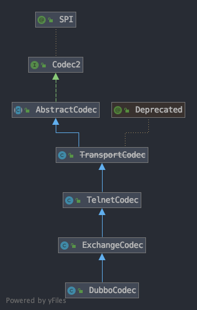

:服务端启动过程: link:dubbo-provider/服务端启动过程.adoc[服务端启动过程]
:服务端如何处理调用请求: link:dubbo-provider/服务端如何处理调用请求.adoc[服务端如何处理调用请求]

= 编解码过程

前提：{服务端启动过程}、{服务端如何处理调用请求}

从笔记{服务端启动过程}可知，Dubbo默认使用netty实现网络交互，其netty的启动过程实现在``NettyServer``类的``doOpen``方法：
[java]
----
@Override
protected void doOpen() throws Throwable {
    bootstrap = new ServerBootstrap();

    bossGroup = NettyEventLoopFactory.eventLoopGroup(1, "NettyServerBoss");
    workerGroup = NettyEventLoopFactory.eventLoopGroup(
            getUrl().getPositiveParameter(IO_THREADS_KEY, Constants.DEFAULT_IO_THREADS),
            "NettyServerWorker");

    final NettyServerHandler nettyServerHandler = new NettyServerHandler(getUrl(), this);
    channels = nettyServerHandler.getChannels();

    bootstrap.group(bossGroup, workerGroup)
            .channel(NettyEventLoopFactory.serverSocketChannelClass())
            .option(ChannelOption.SO_REUSEADDR, Boolean.TRUE)
            .childOption(ChannelOption.TCP_NODELAY, Boolean.TRUE)
            .childOption(ChannelOption.ALLOCATOR, PooledByteBufAllocator.DEFAULT)
            .childHandler(new ChannelInitializer<SocketChannel>() {
                @Override
                protected void initChannel(SocketChannel ch) throws Exception {
                    // FIXME: should we use getTimeout()?
                    int idleTimeout = UrlUtils.getIdleTimeout(getUrl());
                    // getCodec()方法默认返回DubboCountCodec，用于完成编解码
                    NettyCodecAdapter adapter = new NettyCodecAdapter(getCodec(), getUrl(), NettyServer.this);
                    if (getUrl().getParameter(SSL_ENABLED_KEY, false)) {
                        ch.pipeline().addLast("negotiation",
                                SslHandlerInitializer.sslServerHandler(getUrl(), nettyServerHandler));
                    }
                    ch.pipeline()
                            .addLast("decoder", adapter.getDecoder())
                            .addLast("encoder", adapter.getEncoder())
                            .addLast("server-idle-handler", new IdleStateHandler(0, 0, idleTimeout, MILLISECONDS))
                            .addLast("handler", nettyServerHandler);
                }
            });
    // bind
    ChannelFuture channelFuture = bootstrap.bind(getBindAddress());
    channelFuture.syncUninterruptibly();
    channel = channelFuture.channel();

}
----

上面的代码通过``NettyCodecAdapter``类完成编解码过程，而``NettyCodecAdapter``类只是个适配器，其编解码过程由``getCodec``方法的返回值完成，该方法默认返回``DubboCountCodec``对象。``DubboCountCodec``类主要是在解码完成后将读取到的字节数保存到解码后得到的``RpcInvocation``对象的attachment中，其通过``DubboCodec``类实现编解码。``DubboCodec``类的继承树如下：

``TelnetCodec``类及其父类的实现和Dubbo请求执行过程的编解码过程关系并不大，所以这里忽略这一部分的分析，下面先看看``ExchangeCodec``类的实现。首先看编码过程，入口是``encode``方法：
[java]
----
@Override
public void encode(Channel channel, ChannelBuffer buffer, Object msg) throws IOException {
    if (msg instanceof Request) {
        encodeRequest(channel, buffer, (Request) msg);
    } else if (msg instanceof Response) {
        encodeResponse(channel, buffer, (Response) msg);
    } else {
        super.encode(channel, buffer, msg);
    }
}
----

``encodeRequest``方法和``encodeResponse``方法的实现差不多，``super.encode(channel, buffer, msg)``将不能理解的参数交给父类，这里主要看``encodeResponse``方法的实现，代码如下：
[java]
----
/*
协议的格式：
MagicNumber(16 bits)：值固定为0xdabb
Req/Res (1 bit)：Request - 1; Response - 0
2 Way (1 bit)，是否需要服务端返回值：1为需要，0为不需要
Event (1 bit)，是否为事件消息，如心跳事件：1为是，0为否
Serialization ID (5 bit)：当前序列化实现类的id，如fastjson是6，Hessian2是10
Status (8 bits)：只在response中有效
    20 - OK
    30 - CLIENT_TIMEOUT
    31 - SERVER_TIMEOUT
    40 - BAD_REQUEST
    50 - BAD_RESPONSE
    60 - SERVICE_NOT_FOUND
    70 - SERVICE_ERROR
    80 - SERVER_ERROR
    90 - CLIENT_ERROR
    100 - SERVER_THREADPOOL_EXHAUSTED_ERROR
Request ID (64 bits)：请求id
Data Length (32 bits)：请求数据的字节数
数据部分，长度等于Data Length字段：这一部分的数据可以看子类DubboCodec的实现
 */
protected void encodeResponse(Channel channel, ChannelBuffer buffer, Response res) throws IOException {
    // 获取channel的可写入位置的起点
    int savedWriteIndex = buffer.writerIndex();
    try {
        // 获取序列化，默认是Hessian2Serialization
        Serialization serialization = getSerialization(channel);
        // header.
        // header长度为16个字节
        byte[] header = new byte[HEADER_LENGTH];
        // set magic number.
        // 前两个字节为MagicNumber，值为0xdabb
        Bytes.short2bytes(MAGIC, header);
        // set request and serialization flag.
        // 这里没有处理Req/Res (1 bit)位和2 Way，因为当前方法是对response进行编码，Req/Res (1 bit)为0，同时response不需要返回值了
        header[2] = serialization.getContentTypeId();
        // 如果是心跳事件，则设置Event (1 bit)位为1
        if (res.isHeartbeat()) {
            header[2] |= FLAG_EVENT;
        }
        // set response status.
        byte status = res.getStatus();
        // 一个字节的响应结果
        header[3] = status;
        // set request id.
        // 4个字节的request id
        Bytes.long2bytes(res.getId(), header, 4);

        // 从写入位置开始偏移16个字节，为header留下位置
        buffer.writerIndex(savedWriteIndex + HEADER_LENGTH);
        // 序列化响应数据到buffer
        ChannelBufferOutputStream bos = new ChannelBufferOutputStream(buffer);
        ObjectOutput out = serialization.serialize(channel.getUrl(), bos);
        // encode response data or error message.
        if (status == Response.OK) {
            if (res.isHeartbeat()) {
                encodeEventData(channel, out, res.getResult());
            } else {
                // encodeResponseData默认实现是直接调用out.writeObject(data)，其子类DubboCodec重写了该方法
                encodeResponseData(channel, out, res.getResult(), res.getVersion());
            }
        } else {
            // 执行失败直接写入失败原因
            out.writeUTF(res.getErrorMessage());
        }
        out.flushBuffer();
        if (out instanceof Cleanable) {
            ((Cleanable) out).cleanup();
        }
        bos.flush();
        bos.close();

        // 获取响应数据的长度
        int len = bos.writtenBytes();
        // 检查响应数据是否超过长度限制，默认8M
        checkPayload(channel, len);
        // 写入响应数据的长度
        Bytes.int2bytes(len, header, 12);
        // write
        // 从channel的savedWriteIndex开始写入header数据
        buffer.writerIndex(savedWriteIndex);
        buffer.writeBytes(header); // write header.
        // 更新channel的写入位置
        buffer.writerIndex(savedWriteIndex + HEADER_LENGTH + len);
    } catch (Throwable t) {
        // clear buffer
        // 发送异常则清空当前方法写入的数据
        buffer.writerIndex(savedWriteIndex);
        // send error message to Consumer, otherwise, Consumer will wait till timeout.
        if (!res.isEvent() && res.getStatus() != Response.BAD_RESPONSE) {
            Response r = new Response(res.getId(), res.getVersion());
            r.setStatus(Response.BAD_RESPONSE);

            if (t instanceof ExceedPayloadLimitException) {
                logger.warn(t.getMessage(), t);
                try {
                    r.setErrorMessage(t.getMessage());
                    // 直接写入一个Response对象，该对象会重新经过编码
                    channel.send(r);
                    return;
                } catch (RemotingException e) {
                    logger.warn("Failed to send bad_response info back: " + t.getMessage() + ", cause: " + e.getMessage(), e);
                }
            } else {
                // FIXME log error message in Codec and handle in caught() of IoHanndler?
                logger.warn("Fail to encode response: " + res + ", send bad_response info instead, cause: " + t.getMessage(), t);
                try {
                    r.setErrorMessage("Failed to send response: " + res + ", cause: " + StringUtils.toString(t));
                    channel.send(r);
                    return;
                } catch (RemotingException e) {
                    logger.warn("Failed to send bad_response info back: " + res + ", cause: " + e.getMessage(), e);
                }
            }
        }

        // Rethrow exception
        if (t instanceof IOException) {
            throw (IOException) t;
        } else if (t instanceof RuntimeException) {
            throw (RuntimeException) t;
        } else if (t instanceof Error) {
            throw (Error) t;
        } else {
            throw new RuntimeException(t.getMessage(), t);
        }
    }
}
----

上面的代码很简单，按照固定的格式写入信息，对于响应结果，调用``encodeResponseData``方法处理，``DubboCodec``类重写了该方法，代码如下：
[java]
----
@Override
protected void encodeResponseData(Channel channel, ObjectOutput out, Object data, String version) throws IOException {
    Result result = (Result) data;
    // currently, the version value in Response records the version of Request
    // 判断当前版本是否支持attachment
    boolean attach = Version.isSupportResponseAttachment(version);
    Throwable th = result.getException();
    if (th == null) {
        // 没有异常则写入响应结果
        Object ret = result.getValue();
        if (ret == null) {
            // 响应结果为空则写入RESPONSE_NULL_VALUE_WITH_ATTACHMENTS
            out.writeByte(attach ? RESPONSE_NULL_VALUE_WITH_ATTACHMENTS : RESPONSE_NULL_VALUE);
        } else {
            // 否则写入RESPONSE_VALUE_WITH_ATTACHMENTS
            out.writeByte(attach ? RESPONSE_VALUE_WITH_ATTACHMENTS : RESPONSE_VALUE);
            // 写入响应结果
            out.writeObject(ret);
        }
    } else {
        // 发生异常则写入RESPONSE_WITH_EXCEPTION_WITH_ATTACHMENTS
        out.writeByte(attach ? RESPONSE_WITH_EXCEPTION_WITH_ATTACHMENTS : RESPONSE_WITH_EXCEPTION);
        // 写入异常
        out.writeThrowable(th);
    }

    if (attach) {
        // returns current version of Response to consumer side.
        result.getObjectAttachments().put(DUBBO_VERSION_KEY, Version.getProtocolVersion());
        // 写入attachment
        out.writeAttachments(result.getObjectAttachments());
    }
}
----

对于响应结果的写入，是通过``out.writeObject(ret)``语句完成的，默认实现的``Hessian2ObjectOutput``，也就是普通的对象转字节，这里跳过。对于请求的编码也是类似的过程，这里不再赘述。

下面再看看解码的过程，入口是``ExchangeCodec``的``decode``方法：
[java]
----
@Override
public Object decode(Channel channel, ChannelBuffer buffer) throws IOException {
    // 获取数据长度
    int readable = buffer.readableBytes();
    byte[] header = new byte[Math.min(readable, HEADER_LENGTH)];
    // 读取header数据到header数组
    buffer.readBytes(header);
    return decode(channel, buffer, readable, header);
}

@Override
protected Object decode(Channel channel, ChannelBuffer buffer, int readable, byte[] header) throws IOException {
    // check magic number.
    if (readable > 0 && header[0] != MAGIC_HIGH
            || readable > 1 && header[1] != MAGIC_LOW) {
        // 如果当前magic number不合法
        int length = header.length;
        if (header.length < readable) {
            // 创建一个长度为readable的数组，数组内容为header中的值
            header = Bytes.copyOf(header, readable);
            // 将buffer中的剩余部分写入到header
            buffer.readBytes(header, length, readable - length);
        }
        // 从1开始遍历所有的字节（第0个字节在上面已经检查过了），找到magic number
        for (int i = 1; i < header.length - 1; i++) {
            if (header[i] == MAGIC_HIGH && header[i + 1] == MAGIC_LOW) {
                // magic number之前的数据丢弃
                buffer.readerIndex(buffer.readerIndex() - header.length + i);
                // 丢弃的数据保存到header中
                header = Bytes.copyOf(header, i);
                break;
            }
        }
        // 到这里已经得到了合法的magic number之前的数据了，这些数据不能被作为正常的request和response解码，这里直接交给父类处理
        return super.decode(channel, buffer, readable, header);
    }
    // check length.
    // 检查当前可读的字节数属否够header的长度
    if (readable < HEADER_LENGTH) {
        // 不够的话继续读取后面的数据
        return DecodeResult.NEED_MORE_INPUT;
    }

    // get data length.
    // 获取保存在header中的数据的长度
    int len = Bytes.bytes2int(header, 12);
    // 检查数据是否超过长度限制，默认8M
    checkPayload(channel, len);

    // len + HEADER_LENGTH为数据的长度+header的长度，即一个完整请求或响应的长度
    int tt = len + HEADER_LENGTH;
    if (readable < tt) {
        // 数据不够的话继续等待数据，通过这种方式也解决了粘包和半包的问题
        return DecodeResult.NEED_MORE_INPUT;
    }

    // limit input stream.
    // 读取数据部分
    ChannelBufferInputStream is = new ChannelBufferInputStream(buffer, len);

    try {
        return decodeBody(channel, is, header);
    } finally {
        if (is.available() > 0) {
            try {
                if (logger.isWarnEnabled()) {
                    logger.warn("Skip input stream " + is.available());
                }
                StreamUtils.skipUnusedStream(is);
            } catch (IOException e) {
                logger.warn(e.getMessage(), e);
            }
        }
    }
}
----

在理解编码过程后，解码过程也就不难理解了，``decode``方法通过header中的标识位判断当前数据是请求还是响应，分别创建``Request``对象和``Response``对象，反序列化字节数据后返回。值得学习的是解码过程通过固定的header长度和保存在header中的数据长度解决了粘包和半包问题。

以上是编解码的实现。